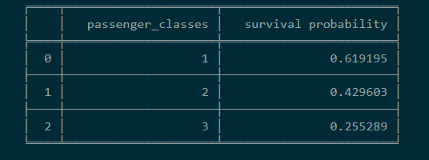
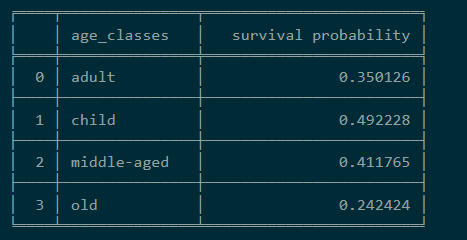
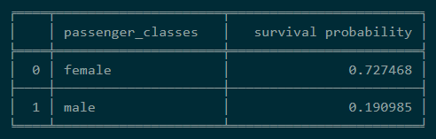

titanic-crash-analytics-

# Analysis of  passenger titanic crash data

Description:

Titanic, a British passenger liner, struck an iceberg and sank on its maiden voyage in 1912. The tragedy resulted in the loss of over 1,500 lives. It remains one of the most infamous maritime disasters in history, sparking widespread changes in maritime safety regulations. The story has been immortalized in numerous books, films, and cultural references, symbolizing both human resilience and the consequences of hubris in the face of nature's power.

General summary:

Survival on the Titanic correlated with factors like gender, age, and class. Women and children had higher survival rates, while men had lower chances. Passengers in first class had better survival odds compared to those in lower classes. Age also played a significant role, with younger individuals more likely to survive. These trends reflect the "women and children first" protocol during the evacuation and the prioritization of upper-class passengers.

Survival probability by age:

Passengers by age classes:

Survival probability by gender:

All this project were done in python using the shared jupyter notebook. 

